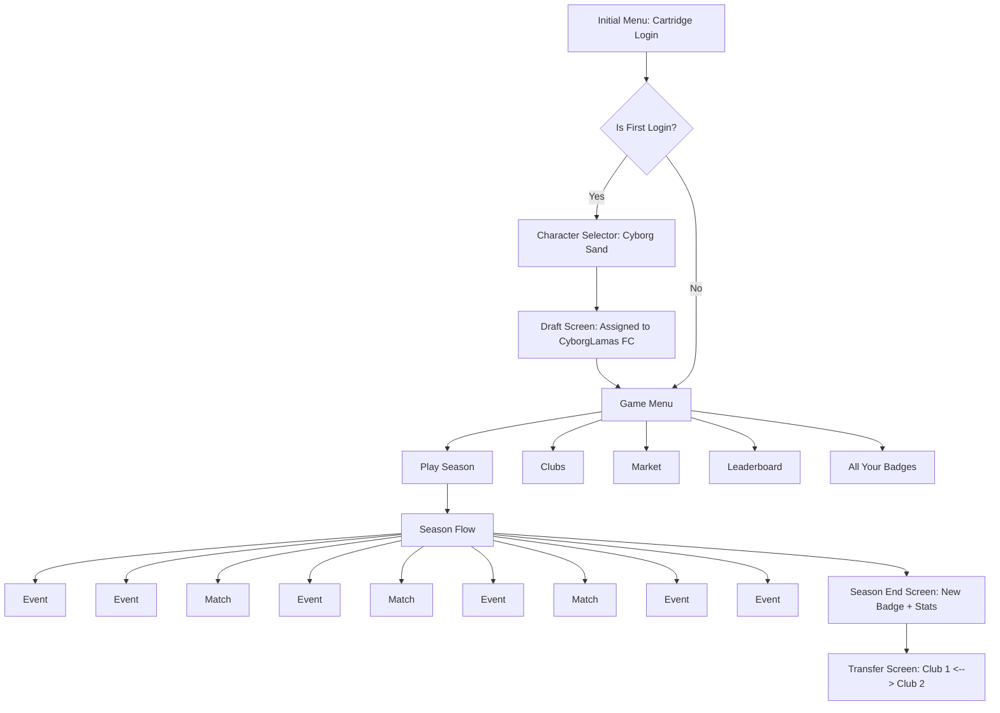

# 🕹️ Overgoal - Game Flow Diagram

---

## 📝 Description of Flow

1. **Login Flow**
   - Players enter via Cartridge.
   - First-time players go through character selection and team draft.
   - Returning players go straight to game menu.

2. **Game Menu**
   - Core options: Play Season, View Clubs, Market, Leaderboard, Badge Collection.

3. **Season Structure**
   - Interleaves **Non-Match Events** and **Matches**.
   - Mix of choices, stats, narrative and missions.

4. **Season End**
   - Player receives visual feedback: stat growth + badges.
   - Option to **Transfer** to a different club.
